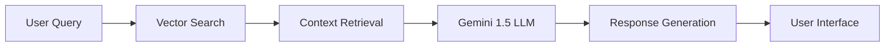

# 🤖 Advanced Gemini-Powered ChatBot with RAG Pipeline
[](https://fastapi.tiangolo.com/)
[](https://reactjs.org/)
[](https://nodejs.org/)
[](https://www.python.org/)

## 📑 Overview

A sophisticated full-stack chatbot application that revolutionizes cybersecurity analysis by combining the power of Google's Gemini 1.5 LLM with OPSWAT's MetaDefender technology. This intelligent system leverages advanced Retrieval-Augmented Generation (RAG) to provide context-aware responses while offering comprehensive file and URL analysis through MetaDefender's robust security features.

### 🛡️ MetaDefender Integration
The chatbot seamlessly integrates with OPSWAT's MetaDefender platform to provide:

- **Multi-scanning Engine Analysis**: Leverages 30+ anti-malware engines for comprehensive threat detection
- **Advanced File Analysis**: Deep inspection of files for potential threats and vulnerabilities
- **Content Disarm and Reconstruction (CDR)**: Sanitizes files by removing potentially malicious content
- **Proactive DLP Controls**: Prevents data leaks and ensures compliance
- **URL Reputation Checking**: Evaluates URL safety and reputation scores
- **Dynamic Unpacking**: Analyzes archived and compressed files
- **Detailed Threat Intelligence**: Provides comprehensive reports on detected threats

### 🎯 Key Objectives
- Provide accurate, context-aware responses to technical queries about cybersecurity
- Deliver enterprise-grade file analysis through MetaDefender integration
- Enable secure URL scanning and threat detection
- Maintain high performance while handling complex security operations
- Ensure reliable and secure data handling with industry-standard protocols

## 🌟 Core Features

### 🔍 Advanced RAG Implementation
- **Vector Search Integration**: Utilizes ChromaDB for efficient similarity search
- **Dynamic Context Retrieval**: Real-time document fetching based on query relevance
- **Intelligent Response Generation**: Combines retrieved context with Gemini 1.5's capabilities

### 🖥️ Modern Web Interface
- **Responsive Design**: Seamless experience across all devices
- **Real-time Updates**: Instant feedback and response generation
- **Drag-and-Drop Interface**: Intuitive file upload functionality
- **URL Analysis**: Direct URL input for content scanning

### ⚡ Dual Backend Architecture
- **FastAPI (Python)**
  - Handles document processing and vector operations
  - Manages RAG pipeline components
  - Provides high-performance API endpoints

- **Node.js Backend**
  - Manages Gemini API interactions
  - Processes file scan operations
  - Handles real-time data streaming

## 🛠️ Technical Architecture

### Frontend Stack
```typescript
{
  "framework": "React 18+ with Vite",
  "styling": "Tailwind CSS",
  "state-management": "React Context + Hooks",
  "http-client": "axios",
  "build-tool": "Vite"
}
```

### Backend Stack
```python
{
  "api_framework": "FastAPI",
  "runtime": "Python 3.10+",
  "server": "uvicorn (ASGI)",
  "vector_store": "ChromaDB",
  "embeddings": "sentence-transformers",
  "llm": "Gemini 1.5"
}
```

### Node.js Components
```javascript
{
  "runtime": "Node.js",
  "framework": "Express",
  "file_handling": "multer",
  "async_processing": "async/await"
}
```

## 🚀 Getting Started

### Prerequisites
- Python 3.10+
- Node.js 16+
- npm/yarn
- Git

### Quick Start

1. **Clone & Setup**
   ```bash
   git clone https://github.com/AlexTGoCreative/ChatBot
   cd ChatBot
   ```

2. **Frontend Installation**
   ```bash
   cd ChatBot-Frontend
   npm install
   npm run dev
   ```

3. **Python Backend Setup**
   ```bash
   cd ChatBot-Backend
   python -m venv venv
   source venv/bin/activate  # or `venv\Scripts\activate` on Windows
   pip install -r requirements.txt
   ```

4. **Initialize Vector Store**
   ```bash
   python scraping_hash_lookup.py
   ```

5. **Start Python Backend**
   ```bash
   uvicorn chat_api:app --reload
   ```

6. **Node.js Backend Setup**
   ```bash
   cd ChatBot-Backend
   npm install
   npm start
   ```

## 🔧 Configuration

### Environment Variables
Create `.env` files in both backend directories:

```env
# Python Backend (.env)
GOOGLE_API_KEY=your_gemini_api_key
VECTOR_STORE_PATH=./vector_store

# Node.js Backend (.env)
PORT=3000
GEMINI_API_KEY=your_gemini_api_key
```

## 🧠 RAG Pipeline Architecture



## 🔍 File Analysis Features

### MetaDefender Security Operations
- **Multi-layered Analysis**
  - File type verification and true type detection
  - Multi-scanning with 30+ anti-malware engines
  - Vulnerability assessment
  - File reputation checking
  
- **Content Security**
  - Advanced Content Disarm and Reconstruction (CDR)
  - Archive extraction and analysis
  - Document sanitization
  - Executable analysis

- **URL Security**
  - Real-time URL scanning
  - Reputation database checking
  - Phishing detection
  - SSL certificate validation
  
- **Threat Intelligence**
  - Detailed threat reports
  - MITRE ATT&CK mapping
  - Threat classification
  - Risk scoring

### Security Measures
- File type validation through MetaDefender
- Size limitations based on enterprise standards
- Secure file handling with sanitization
- Sanitized user inputs
- Real-time threat monitoring
- Quarantine capabilities for suspicious files

## 📈 Performance Optimization

- **Caching**: Implemented for frequently accessed data
- **Lazy Loading**: Used for component and resource loading
- **Connection Pooling**: Optimized database connections
- **Rate Limiting**: Prevents API abuse

## 🤝 Contributing

We welcome contributions! Please see our [Contributing Guidelines](CONTRIBUTING.md) for details.

## 📄 License

This project is licensed under the MIT License - see the [LICENSE](LICENSE) file for details.

## 🙏 Acknowledgments

- Google Gemini team for the powerful LLM API
- OPSWAT for comprehensive documentation
- Open-source community for various tools and libraries

---

<div align="center">
Made with ❤️ by the ChatBot Team
</div>
